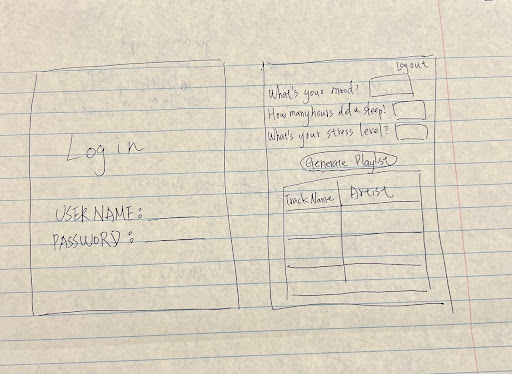

# Project Title
Mood Diary App

# Project Summary
This project involves developing a website/app called “Mood Diary app ”. Users can input their mood daily, and by analyzing the mental state of the user, a mood-enhancing playlist can boost the emotional well-being of the user. The app will dynamically adjust the playlist every time the user updates their mood. 

# Description
We want to help users enhance their emotional well-being by personalizing music recommendations. The problem that we want to solve is that people often struggle to find the right music to perfectly match their current mood. By allowing the user to log their mood daily or every time they want, our app can analyze the mental state and generate a customized music playlist for the user. The playlist will continue to be adjusted based on the user updates. 

# Creative Component
This app utilizes a recommendation algorithm from the Spotify API. Interactive data visualization will display user mood trends over time. The user can update their moods on a daily basis, by providing a text prompt about their day we can produce a set of scores to analyze their mood. The user could also manually adjust the mood scores if they are not satisfied with the generated result, then we would suggest the user a spotify playlist accordingly. To encourage daily app usage, we will implement global and local leaderboards where users can compete for the longest streak of consecutive days using the app.

We have a total of 5 tables in our application. 
- User table: Maintenance the user login information, including personal details and passwords.
- Playlist table: This is a kaggle dataset collected online that contains information about songs on spotify and when they should be suggested to users.
- Mood and health table: This table uses several evaluation aspects to query the corresponding mood score for the users.
- Leaderboard table: Leaderboard table will be dynamically managed by our application to provide real time data consecutive login days of active users.
- User song history table: Each user has a corresponding history table that they can use to look up our past customized playlist, and the mood they recorded in the past. 

# Usefulness
This app helps users create unique playlists and discover new music. Spotify already creates playlists with moods like happy, cozy, romantic, and party, but these are premade and not personalized to the users' fluctuating moods.

# Realness
- [Dataset 1](https://www.kaggle.com/datasets/thedevastator/spotify-tracks-genre-dataset): We collect the student health and attendance dataset from Kaggle. This dataset is a csv file with degrees of 9 and 500 cardinalities. The table contains information about a student’s attendance records and their sleep score, stress level…etc. This data helps us determine a student’s mood, allowing personalization of the music playlist.
- [Dataset 2](https://www.kaggle.com/datasets/ziya07/student-health-and-attendance-data/data)
- Other resources: Spotify Web API: Provides real-time track information, metadata, and search capabilities.

# Functionality
- A user will choose from a scale of 1-5 on mood related questions, creating a new playlist based on the calculated mood score.
- The scaled inputs can be updated to generate slightly different playlists.
- Users can search for past mood scores and playlists.
- Users can be deleted if not in use anymore.
- There will be a global leaderboard for users to compete on consecutive login days with their friends.

# Low-fidelity UI Mockup

# Project work distribution
- Frontend + UI design: Megan, Bosyuan
- Backend: Yu-Liang, Sydney
- Database implementation: All team members work together
