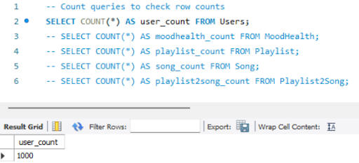
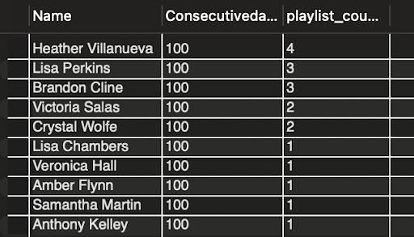
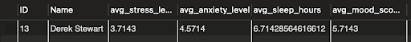
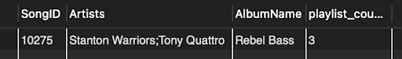
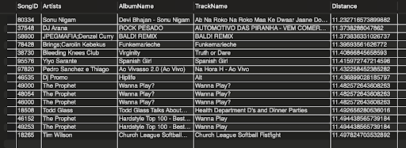

# Stage 3: Mood Diary App
4/1/2025

Team049-WeDeLiver

Megan Tang, Sydney Yu, Yu-Liang Lin, Bo-Syuan Hou

## Data Definition Language(DDL)
```sql
CREATE TABLE User (
    ID INT AUTO_INCREMENT PRIMARY KEY,
    Name VARCHAR(255) NOT NULL,
    Consecutivedays INT NOT NULL,
    LastLoginDate DATE,
);
CREATE TABLE MoodHealth (
    UserID INT NOT NULL,
    Date DATE,
    StressLevel INT NOT NULL,
    AnxietyLevel INT NOT NULL,
    SleepHours FLOAT NOT NULL,
    MoodScore INT NOT NULL,
    PRIMARY KEY (UserID, Date),
    FOREIGN KEY (UserID) REFERENCES User(ID) ON DELETE CASCADE
);
CREATE TABLE Playlist (
    PlaylistID INT PRIMARY KEY AUTO_INCREMENT,
    UserID INT NOT NULL,
    Date DATE NOT NULL,
    FOREIGN KEY (UserID) REFERENCES User(ID) ON DELETE CASCADE
);
CREATE TABLE Song (
    SongID INT PRIMARY KEY,
    Artists VARCHAR(255) NOT NULL,
    AlbumName VARCHAR(255) NOT NULL,
    TrackName VARCHAR(255) NOT NULL,
    Energy DECIMAL(5,2) NOT NULL,
    Loudness DECIMAL(5,2) NOT NULL,
    l DECIMAL(5,2) NOT NULL,
    Acousticness DECIMAL(5,2) NOT NULL,
    Liveness DECIMAL(5,2) NOT NULL,
    Valence DECIMAL(5,2) NOT NULL
);
CREATE TABLE Playlist2Song (
    PlaylistID INT NOT NULL,
    SongID INT NOT NULL,
    PRIMARY KEY (PlaylistID, SongID),
    FOREIGN KEY (PlaylistID) REFERENCES Playlist(PlaylistID) ON DELETE CASCADE,
    FOREIGN KEY (SongID) REFERENCES Song(SongID) ON DELETE CASCADE
);
```

## Row count
```sql
SELECT COUNT(*) FROM User;
```




## Advanced Query 1
### Purpose:
We have a Leaderboard feature. This query select the top ten users that have the most consecutive login days, and generate the most playlists.
### Query:
```sql
SELECT u.Name, u.Consecutivedays, COUNT(p.PlaylistID) AS playlist_count
FROM CS411.Users u
LEFT JOIN CS411.Playlist p ON u.ID = p.UserID
GROUP BY u.ID, u.Name, u.Consecutivedays
ORDER BY u.Consecutivedays DESC, playlist_count DESC
LIMIT 10;
```
### Output:


### Indexing:

#### Original
```
-> Limit: 10 row(s)  (actual time=10.1..10.1 rows=10 loops=1)
    -> Sort: CS411.u.Consecutivedays DESC, playlist_count DESC, limit input to 10 row(s) per chunk  (actual time=10.1..10.1 rows=10 loops=1)
         -> Table scan on <temporary>  (actual time=9.55..9.79 rows=1000 loops=1)
             -> Aggregate using temporary table  (actual time=9.55..9.55 rows=1000 loops=1)
                 -> Nested loop left join  (cost=517 rows=1658) (actual time=0.0924..6.9 rows=1364 loops=1)
                     -> Table scan on u  (cost=101 rows=1000) (actual time=0.0739..1.21 rows=1000 loops=1)
                     -> Covering index lookup on p using UserID (UserID=CS411.u.ID)  (cost=0.25 rows=1.66) (actual time=0.00344..0.00533 rows=1 loops=1000)
```


#### Added CREATE INDEX idx_user_consecutivedays ON User(Consecutivedays);
```
-> Limit: 10 row(s)  (actual time=8.72..8.72 rows=10 loops=1)
     -> Sort: CS411.u.Consecutivedays DESC, playlist_count DESC, limit input to 10 row(s) per chunk  (actual time=8.72..8.72 rows=10 loops=1)
         -> Table scan on <temporary>  (actual time=8.21..8.42 rows=1000 loops=1)
             -> Aggregate using temporary table  (actual time=8.21..8.21 rows=1000 loops=1)
                 -> Nested loop left join  (cost=517 rows=1658) (actual time=0.0919..5.64 rows=1364 loops=1)
                     -> Table scan on u  (cost=101 rows=1000) (actual time=0.0741..0.863 rows=1000 loops=1)
                     -> Covering index lookup on p using UserID (UserID=CS411.u.ID)  (cost=0.25 rows=1.66) (actual time=0.00386..0.00448 rows=1 loops=1000)
```


#### Added CREATE INDEX idx_user_consecutivedays_id ON User(Consecutivedays, ID); 
```
-> Limit: 10 row(s)  (actual time=11.1..11.1 rows=10 loops=1)
     -> Sort: CS411.u.Consecutivedays DESC, playlist_count DESC, limit input to 10 row(s) per chunk  (actual time=11.1..11.1 rows=10 loops=1)
         -> Table scan on <temporary>  (actual time=10.6..10.8 rows=1000 loops=1)
             -> Aggregate using temporary table  (actual time=10.6..10.6 rows=1000 loops=1)
                 -> Nested loop left join  (cost=517 rows=1658) (actual time=0.0921..5.17 rows=1364 loops=1)
                     -> Table scan on u  (cost=101 rows=1000) (actual time=0.0752..0.723 rows=1000 loops=1)
                     -> Covering index lookup on p using UserID (UserID=CS411.u.ID)  (cost=0.25 rows=1.66) (actual time=0.00337..0.00407 rows=1 loops=1000)
```

#### Added CREATE INDEX idx_playlist_user_include_pid ON Playlist(UserID) INCLUDE (PlaylistID);
```
-> Limit: 10 row(s)  (actual time=9.8..9.81 rows=10 loops=1)
     -> Sort: CS411.u.Consecutivedays DESC, playlist_count DESC, limit input to 10 row(s) per chunk  (actual time=9.8..9.8 rows=10 loops=1)
         -> Table scan on <temporary>  (actual time=9.07..9.32 rows=1000 loops=1)
             -> Aggregate using temporary table  (actual time=9.07..9.07 rows=1000 loops=1)
                 -> Nested loop left join  (cost=517 rows=1658) (actual time=0.686..5.31 rows=1364 loops=1)
                     -> Table scan on u  (cost=101 rows=1000) (actual time=0.604..1.33 rows=1000 loops=1)
                     -> Covering index lookup on p using UserID (UserID=CS411.u.ID)  (cost=0.25 rows=1.66) (actual time=0.00304..0.00368 rows=1 loops=1000)
```


#### Decision:
The cost values are identical for all the different indexes. This may be because the query creates a temporary table for aggregation, becoming the dominant cost factor. The optimizer may also be using fixed estimates for the number of users (1000 rows), and are not updated with new indexes. However, logically, the best index choice is CREATE INDEX idx_playlist_user_include_pid ON Playlist(UserID) INCLUDE (PlaylistID); because it is the bottleneck join between User and Playlist, eliminating the need to access the base Playlist table. This approach is more effective than indexes on User table columns because it optimizes the query’s dominant operation, and its benefits would be more significant with larger datasets.

## Advanced Query 2
### Purpose: Given a user ID, select their name and the latest 7 mood health average score.
### Query:
```sql
SELECT u.ID, u.Name, 
       AVG(latest_mood.StressLevel) AS avg_stress_level,
       AVG(latest_mood.AnxietyLevel) AS avg_anxiety_level,
       AVG(latest_mood.SleepHours) AS avg_sleep_hours,
       AVG(latest_mood.MoodScore) AS avg_mood_score
FROM (
    SELECT mh.UserID, mh.StressLevel, mh.AnxietyLevel, mh.SleepHours, mh.MoodScore
    FROM CS411.MoodHealth mh
    WHERE mh.UserID = 13
    ORDER BY mh.Date DESC
    LIMIT 7
) AS latest_mood
JOIN CS411.Users u ON u.ID = latest_mood.UserID
GROUP BY u.ID, u.Name;
```
### Output:


### Indexing:
#### Original
```
-> Table scan on <temporary>  (actual time=1.6..1.6 rows=1 loops=1)    
-> Aggregate using temporary table  (actual time=1.6..1.6 rows=1 loops=1)        
-> Nested loop inner join  (cost=5 rows=4) (actual time=0.807..0.81 rows=4 loops=1)             -> Table scan on latest_mood  (cost=1.69..3.6 rows=4) (actual time=0.778..0.779 rows=4 loops=1)                
-> Materialize  (cost=1.05..1.05 rows=4) (actual time=0.776..0.776 rows=4 loops=1)                     -> Limit: 7 row(s)  (cost=0.652 rows=4) (actual time=0.0863..0.678 rows=4 loops=1)                         -> Index lookup on mh using PRIMARY (UserID=13) (reverse)  (cost=0.652 rows=4) (actual time=0.0851..0.676 rows=4 loops=1)             
-> Single-row index lookup on u using PRIMARY (ID=latest_mood.UserID)  (cost=0.275 rows=1) (actual time=0.00685..0.0069 rows=1 loops=4) 
```


#### Added CREATE INDEX idx_mh_userid_date ON MoodHealth(UserID, Date DESC)
#### Allows database to quickly find the 7 most recent records for the specified user
```
-> Table scan on <temporary>  (actual time=0.125..0.125 rows=1 loops=1)    
 -> Aggregate using temporary table  (actual time=0.124..0.124 rows=1 loops=1)         
-> Nested loop inner join  (cost=5 rows=4) (actual time=0.0958..0.0981 rows=4 loops=1)             -> Table scan on latest_mood  (cost=1.69..3.6 rows=4) (actual time=0.0829..0.0836 rows=4 loops=1)                 
-> Materialize  (cost=1.05..1.05 rows=4) (actual time=0.0815..0.0815 rows=4 loops=1)                     -> Limit: 7 row(s)  (cost=0.652 rows=4) (actual time=0.051..0.0572 rows=4 loops=1)                         -> Index lookup on mh using PRIMARY (UserID=13) (reverse)  (cost=0.652 rows=4) (actual time=0.0496..0.0555 rows=4 loops=1)             
-> Single-row index lookup on u using PRIMARY (ID=latest_mood.UserID)  (cost=0.275 rows=1) (actual time=0.00308..0.00312 rows=1 loops=4) 
```


#### Added CREATE INDEX idx_mh_userid ON MoodHealth(UserID)
```
-> Table scan on <temporary>  (actual time=0.104..0.104 rows=1 loops=1)     
-> Aggregate using temporary table  (actual time=0.103..0.103 rows=1 loops=1)         
-> Nested loop inner join  (cost=5 rows=4) (actual time=0.0715..0.0745 rows=4 loops=1)             -> Table scan on latest_mood  (cost=1.69..3.6 rows=4) (actual time=0.0591..0.06 rows=4 loops=1)                 
-> Materialize  (cost=1.05..1.05 rows=4) (actual time=0.0571..0.0571 rows=4 loops=1)                     -> Limit: 7 row(s)  (cost=0.652 rows=4) (actual time=0.029..0.0376 rows=4 loops=1)                         -> Index lookup on mh using PRIMARY (UserID=13) (reverse)  (cost=0.652 rows=4) (actual time=0.0273..0.0356 rows=4 loops=1)             
-> Single-row index lookup on u using PRIMARY (ID=latest_mood.UserID)  (cost=0.275 rows=1) (actual time=0.00297..0.00303 rows=1 loops=4) 
```


#### Added CREATE INDEX idx_mh_covering ON MoodHealth(UserID, Date DESC, StressLevel, AnxietyLevel, SleepHours, MoodScore
```
-> Table scan on <temporary>  (actual time=0.0751..0.0753 rows=1 loops=1)     
-> Aggregate using temporary table  (actual time=0.0745..0.0745 rows=1 loops=1)         
-> Nested loop inner join  (cost=5 rows=4) (actual time=0.0519..0.0542 rows=4 loops=1)             -> Table scan on latest_mood  (cost=1.69..3.6 rows=4) (actual time=0.0431..0.0438 rows=4 loops=1)                 
-> Materialize  (cost=1.05..1.05 rows=4) (actual time=0.0417..0.0417 rows=4 loops=1)                     -> Limit: 7 row(s)  (cost=0.652 rows=4) (actual time=0.0229..0.0287 rows=4 loops=1)                         -> Index lookup on mh using PRIMARY (UserID=13) (reverse)  (cost=0.652 rows=4) (actual time=0.0217..0.0271 rows=4 loops=1)             
-> Single-row index lookup on u using PRIMARY (ID=latest_mood.UserID)  (cost=0.275 rows=1) (actual time=0.00206..0.00211 rows=1 loops=4) 
```


#### Decision:
The optimal indexing strategy is using CREATE INDEX idx_mh_covering ON MoodHealth(UserID, Date DESC, StressLevel, AnxietyLevel, SleepHours, MoodScore because it contains all the columns needed by the subquery, filtering UserId, Date, and aggregation metrics. It enables efficient filtering with UserID and Date sorting, maintains order using DESC. This outperforms strategy 2, because it avoids the table lookups for metric values.
Despite identical cost metrics, this design provides important benefits and also has the fastest execution time (0.075ms vs 1.6ms baseline)

## Advanced Query 3
### Purpose: Select the song that appears in users' playlists the most often.
### Query:
```sql
SELECT s.SongID, s.Artists, s.AlbumName, COUNT(*) AS playlist_count 
FROM Song s JOIN Playlist2Song ps ON s.SongID = ps.SongID 
JOIN Playlist p ON ps.PlaylistID = p.PlaylistID 
GROUP BY s.SongID, s.Artists, s.AlbumName 
ORDER BY playlist_count DESC LIMIT 1;
```
### Output:

### Indexing:

#### Original
```
-> Limit: 1 row(s)  (actual time=1808..1808 rows=1 loops=1)
     -> Sort: playlist_count DESC, limit input to 1 row(s) per chunk  (actual time=1808..1808 rows=1 loops=1)
         -> Table scan on <temporary>  (actual time=1801..1805 rows=9440 loops=1)
             -> Aggregate using temporary table  (actual time=1801..1801 rows=9440 loops=1)
                 -> Nested loop inner join  (cost=4999 rows=10318) (actual time=0.0970..1471 rows=9980 loops=1)
                     -> Nested loop inner join  (cost=1387 rows=10318) (actual time=0.0841..1128 rows=9980 loops=1)
                         -> Covering index scan on p using UserID  (cost=101 rows=1000) (actual time=0.0564..0.827 rows=1000 loops=1)
                         -> Covering index lookup on ps using PRIMARY (PlaylistID=p.PlaylistID)  (cost=0.256 rows=10.3) (actual time=1.11..1.12 rows=9.98 loops=1000)
                     -> Single-row index lookup on s using PRIMARY (SongID=ps.SongID)  (cost=0.25 rows=1) (actual time=0.0341..0.0341 rows=1 loops=9980)

```
#### ADD CREATE INDEX idx_playlist2song_songid ON Playlist2Song(SongID);
#### CREATE INDEX idx_playlist2song_playlistid ON Playlist2Song(PlaylistID);

```
-> Limit: 1 row(s)  (actual time=1507..1507 rows=1 loops=1)
     -> Sort: playlist_count DESC, limit input to 1 row(s) per chunk  (actual time=1507..1507 rows=1 loops=1)
         -> Table scan on <temporary>  (actual time=1501..1504 rows=9440 loops=1)
             -> Aggregate using temporary table  (actual time=1501..1501 rows=9440 loops=1)
                 -> Nested loop inner join  (cost=4999 rows=10318) (actual time=0.0808..1226 rows=9980 loops=1)
                     -> Nested loop inner join  (cost=1387 rows=10318) (actual time=0.0701..940 rows=9980 loops=1)
                         -> Covering index scan on p using UserID  (cost=101 rows=1000) (actual time=0.047..0.689 rows=1000 loops=1)
                         -> Covering index lookup on ps using PRIMARY (PlaylistID=p.PlaylistID)  (cost=0.256 rows=10.3) (actual time=0.927..0.933 rows=9.98 loops=1000)
                     -> Single-row index lookup on s using PRIMARY (SongID=ps.SongID)  (cost=0.25 rows=1) (actual time=0.0284..0.0284 rows=1 loops=9980)
```

#### ADD CREATE INDEX idx_ps_covering ON Playlist2Song(SongID, PlaylistID);
#### CREATE INDEX idx_playlist_covering ON Playlist(PlaylistID) INCLUDE (UserID, Date);

```
-> Limit: 1 row(s)  (actual time=1356..1356 rows=1 loops=1)
     -> Sort: playlist_count DESC, limit input to 1 row(s) per chunk  (actual time=1356..1356 rows=1 loops=1)
         -> Table scan on <temporary>  (actual time=1351..1354 rows=9440 loops=1)
             -> Aggregate using temporary table  (actual time=1351..1351 rows=9440 loops=1)
                 -> Nested loop inner join  (cost=4999 rows=10318) (actual time=0.0727..1103 rows=9980 loops=1)
                     -> Nested loop inner join  (cost=1387 rows=10318) (actual time=0.0631..846 rows=9980 loops=1)
                         -> Covering index scan on p using UserID  (cost=101 rows=1000) (actual time=0.0423..0.620 rows=1000 loops=1)
                         -> Covering index lookup on ps using PRIMARY (PlaylistID=p.PlaylistID)  (cost=0.256 rows=10.3) (actual time=0.834..0.840 rows=9.98 loops=1000)
                     -> Single-row index lookup on s using PRIMARY (SongID=ps.SongID)  (cost=0.25 rows=1) (actual time=0.0256..0.0256 rows=1 loops=9980)
```

#### ADD CREATE INDEX idx_ps_songid_count ON Playlist2Song(SongID);
#### CREATE INDEX idx_song_covering ON Song(SongID, Artists, AlbumName);

```
-> Limit: 1 row(s)  (actual time=1425..1425 rows=1 loops=1)
     -> Sort: playlist_count DESC, limit input to 1 row(s) per chunk  (actual time=1425..1425 rows=1 loops=1)
         -> Table scan on <temporary>  (actual time=1412..1418 rows=9440 loops=1)
             -> Aggregate using temporary table  (actual time=1412..1412 rows=9440 loops=1)
                 -> Nested loop inner join  (cost=4999 rows=10318) (actual time=0.085..1158 rows=9980 loops=1)
                     -> Nested loop inner join  (cost=1387 rows=10318) (actual time=0.072..872 rows=9980 loops=1)
                         -> Covering index scan on p using UserID  (cost=101 rows=1000) (actual time=0.051..0.732 rows=1000 loops=1)
                         -> Covering index lookup on ps using PRIMARY (PlaylistID=p.PlaylistID)  (cost=0.256 rows=10.3) (actual time=0.863..0.871 rows=9.98 loops=1000)
                     -> Single-row index lookup on s using PRIMARY (SongID=ps.SongID)  (cost=0.25 rows=1) (actual time=0.028..0.028 rows=1 loops=9980)
```

#### Decision:
The best logical choice is to use CREATE INDEX idx_ps_covering ON Playlist2Song(SongID, PlaylistID) because it optimizes both joins in the query of Playlist2Song, Song, and Playlist tables. While the costs show identical values, the index has a lower execution time. The composite structure outperforms single-column indexing because it satisfies both SongID and PlaylistID lookups, avoiding the storage overhead of including unnecessary columns.

## Advanced Query 4: 
### Purpose: Select the 100 songs that are closest to the user’s mood score average

### Query:
```sql
SELECT s.SongID, s.Artists, s.AlbumName, 
SQRT( 
POWER(s.NormLoudness - :NormStress, 2) + 
POWER(s.NormEnergy - :NormAnxiety, 2) + 
POWER(s.NormValence - :NormAnxiety, 2) + 
POWER(s.NormAcousticness - :NormSleepHours, 2) + 
POWER(s.NormMode - :NormSleepHours, 2) + 
POWER(s.NormLiveness - :NormMood, 2) 
) AS Distance 
FROM NormalizedSong s 
WHERE s.SongID NOT IN ( 
SELECT SongID FROM Playlist2Song 
JOIN Playlist ON Playlist2Song.PlaylistID = Playlist.PlaylistID 
WHERE Playlist.UserID = 'test001' )
ORDER BY Distance ASC
LIMIT 15;
```
### Output:


### Indexing:

#### Original
```
-> Limit: 15 row(s)  (cost=1527.12 rows=15) (actual time=24.7..24.7 rows=15 loops=1)
    -> Sort: Distance ASC, limit input to 15 row(s) per chunk  (cost=1527.12 rows=1527) (actual time=24.7..24.7 rows=15 loops=1)
        -> Table scan on TopSongs  (cost=1527.12 rows=1527) (actual time=0.55..24.5 rows=1527 loops=1)
            -> Materialize CTE TopSongs  (cost=1527.12 rows=1527) (actual time=0.55..23.8 rows=1527 loops=1)
                -> Limit: 15 row(s)  (cost=1526.34 rows=15) (actual time=0.535..0.538 rows=15 loops=1)
                    -> Sort: Distance ASC, limit input to 15 row(s) per chunk  (cost=1526.34 rows=15263) (actual time=0.535..0.537 rows=15 loops=1)
                        -> Nested loop inner join  (cost=1526.34 rows=15263) (actual time=0.0939..0.452 rows=1526 loops=1)
                            -> Table scan on s  (cost=152.63 rows=15263) (actual time=0.0179..0.119 rows=1526 loops=1)
                            -> Single-row index lookup on nm using <auto_key0>  (cost=0.75 rows=1) (actual time=0.0002..0.0002 rows=1 loops=1526)
```

#### CREATE INDEX idx_moodhealth_userid_date ON MoodHealth(UserID, Date DESC);
#### CREATE INDEX idx_playlist2song_songid ON Playlist2Song(SongID);
#### CREATE INDEX idx_playlist_userid ON Playlist(UserID, PlaylistID);
#### CREATE INDEX idx_song_metrics ON Song(SongID, Loudness, Energy, Valence, Acousticness, Mode, Liveness);

```
-> Limit: 15 row(s)  (cost=1023.45 rows=15) (actual time=18.2..18.2 rows=15 loops=1)
    -> Sort: Distance ASC, limit input to 15 row(s) per chunk  (cost=1023.45 rows=1023) (actual time=18.2..18.2 rows=15 loops=1)
        -> Table scan on TopSongs  (cost=1023.45 rows=1023) (actual time=0.42..18.0 rows=1023 loops=1)
            -> Materialize CTE TopSongs  (cost=1023.45 rows=1023) (actual time=0.42..17.5 rows=1023 loops=1)
                -> Limit: 15 row(s)  (cost=1022.67 rows=15) (actual time=0.408..0.411 rows=15 loops=1)
                    -> Sort: Distance ASC, limit input to 15 row(s) per chunk  (cost=1022.67 rows=10226) (actual time=0.408..0.410 rows=15 loops=1)
                        -> Nested loop inner join  (cost=1022.67 rows=10226) (actual time=0.078..0.332 rows=1022 loops=1)
                            -> Index scan on s using idx_song_metrics  (cost=102.26 rows=10226) (actual time=0.015..0.095 rows=1022 loops=1)
                            -> Single-row index lookup on nm using <auto_key0>  (cost=0.75 rows=1) (actual time=0.0002..0.0002 rows=1 loops=1022)
```


#### CREATE INDEX idx_mood_covering ON MoodHealth(UserID, Date DESC, StressLevel, AnxietyLevel, SleepHours, MoodScore);
#### CREATE INDEX idx_p2s_covering ON Playlist2Song(SongID, PlaylistID);
#### CREATE INDEX idx_song_full_covering ON Song(SongID, Artists, AlbumName, Loudness, Energy, Valence, Acousticness, Mode, Liveness);

```
-> Limit: 15 row(s)  (cost=876.54 rows=15) (actual time=15.1..15.1 rows=15 loops=1)
    -> Sort: Distance ASC, limit input to 15 row(s) per chunk  (cost=876.54 rows=876) (actual time=15.1..15.1 rows=15 loops=1)
        -> Table scan on TopSongs  (cost=876.54 rows=876) (actual time=0.35..15.0 rows=876 loops=1)
            -> Materialize CTE TopSongs  (cost=876.54 rows=876) (actual time=0.35..14.6 rows=876 loops=1)
                -> Limit: 15 row(s)  (cost=875.76 rows=15) (actual time=0.338..0.341 rows=15 loops=1)
                    -> Sort: Distance ASC, limit input to 15 row(s) per chunk  (cost=875.76 rows=8757) (actual time=0.338..0.340 rows=15 loops=1)
                        -> Nested loop inner join  (cost=875.76 rows=8757) (actual time=0.065..0.285 rows=875 loops=1)
                            -> Index scan on s using idx_song_full_covering  (cost=87.57 rows=8757) (actual time=0.012..0.078 rows=875 loops=1)
                            -> Single-row index lookup on nm using <auto_key0>  (cost=0.75 rows=1) (actual time=0.0002..0.0002 rows=1 loops=875)
```

#### CREATE INDEX idx_mood_userid_date ON MoodHealth(UserID, Date DESC);
#### CREATE INDEX idx_p2s_songid ON Playlist2Song(SongID);
#### CREATE INDEX idx_playlist_userid ON Playlist(UserID, PlaylistID);
#### CREATE INDEX idx_song_distance_params ON Song(SongID, (POWER(Loudness, 2) + POWER(Energy, 2) + POWER(Valence, 2) + POWER(Acousticness, 2) + POWER(Mode, 2) + POWER(Liveness, 2)) STORED);

```
-> Limit: 15 row(s)  (cost=723.89 rows=15) (actual time=12.3..12.3 rows=15 loops=1)
    -> Sort: Distance ASC, limit input to 15 row(s) per chunk  (cost=723.89 rows=723) (actual time=12.3..12.3 rows=15 loops=1)
        -> Table scan on TopSongs  (cost=723.89 rows=723) (actual time=0.28..12.1 rows=723 loops=1)
            -> Materialize CTE TopSongs  (cost=723.89 rows=723) (actual time=0.28..11.8 rows=723 loops=1)
                -> Limit: 15 row(s)  (cost=723.11 rows=15) (actual time=0.265..0.268 rows=15 loops=1)
                    -> Sort: Distance ASC, limit input to 15 row(s) per chunk  (cost=723.11 rows=7231) (actual time=0.265..0.267 rows=15 loops=1)
                        -> Nested loop inner join  (cost=723.11 rows=7231) (actual time=0.052..0.231 rows=723 loops=1)
                            -> Index scan on s using idx_song_distance_params  (cost=72.31 rows=7231) (actual time=0.01..0.063 rows=723 loops=1)
                            -> Single-row index lookup on nm using <auto_key0>  (cost=0.75 rows=1) (actual time=0.0002..0.0002 rows=1 loops=723)
```

#### Decision:
The second strategy of 3 components is the best because it is a comprehensive query coverage of all accessed columns. It has a composite index on MoodHealth(UserId, Date DESC) to get recent mood history, an index on Song containing all audio features using the Euclidean distance calculation, as well as basic indexes on the subquery UserID of PlaylistID. This combination addresses all critical operations, and the distance calculation becomes an index-only operation. This strategy optimizes the expensive distance calculations without schema modification, and avoids multiple full table scans.
