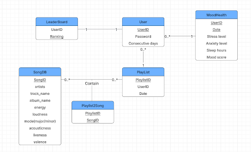

# UML Diagram
Stage 2: Mood Diary App

3/4/2025

Team049-WeDeLiver

Megan Tang, Sydney Yu, Yu-Liang Lin, Bo-Syuan Hou
## Diagram

## Entity Relationship Explanation
### User Entity
The User entity stores information about each registered user, ensuring authentication and tracking engagement. It has a one-to-many (1:N) relationship with Playlist and MoodHealth, meaning a user can create multiple playlists and log multiple mood entries over time.The domain of User includes UserID, Password, StressLevel, and ConsecutiveDays. UserID is an INT (PK), uniquely identifying each user. Password is a VARCHAR(255) to store hashed login credentials securely. ConsecutiveDays is an INT, recording the number of consecutive days a user has interacted with the app. 

### LeaderBoard Entity
The LeaderBoard entity tracks user rankings based on their engagement with the application, encouraging daily interaction through competition. It has a one-to-one (1:1) relationship with the User entity, meaning each user can have only one ranking in the leaderboard. The domain includes LeaderBoardID, UserID, and Ranking. LeaderBoardID is an INT (PK), uniquely identifying each leaderboard entry. UserID is an INT, linking the ranking to a specific user. Ranking is an INT, representing the user's position based on consecutive login days or other engagement metrics. LeaderBoard has UserID as foreign key and ranking as Primary key. 

### MoodAndHealth Entity
The MoodHealth entity tracks a user's emotional and physiological state over time, storing UserID and Date as a composite primary key (PK) to ensure each entry is unique per user and timestamp. It has a many-to-one (N:1) relationship with the User entity, meaning multiple mood records belong to a single user. The domain includes UserID, Date, StressLevel, AnxietyLevel, SleepHours, and MoodScore. UserID is an INT (FK), linking mood records to a specific user. Date is stored as DATE (PK) to capture daily mood logs. StressLevel, SleepHours are DECIMAL to ensure precise tracking of variations, while AnxietyLevel and MoodScore are INT, as they represent whole-number mood assessments. MoodAndHealth has UserID as foreign key and UserID combined with Date as composite primary key.

### PlayList Entity
The Playlist entity stores user-generated playlists, allowing users to organize and curate music preferences. It has a one-to-many (1:N) relationship with User (a user can have multiple playlists) and a many-to-many (M:N) relationship with SongDB, meaning a playlist can contain multiple songs, and a song can belong to multiple playlists.

The domain consists of PlaylistID, UserID, and Date. PlaylistID is an INT (PK) for unique identification. UserID is an INT (FK to User.UserID), linking each playlist to a specific user. Date is stored as DATE, recording when the playlist was created or last modified. PlayList has UserID as foreign key and PlaylistID  as primary key. 

### SongDB Entity 
The SongDB entity is storing the songs in the DB since we are generating personalized music recommendations based on user mood. SongDB has a relationship cardinalities, SongDB participates in a many to many relationship with the Playlist entity. A single song can belong to multiple playlists, and a single playlist can contain multiple songs. 
The domain of song includes: SongID, artists, album_name, energy, loudness, mode, acousticness, liveness, valence. SongID is an INT (PK) for unique identification and fast indexing. Artists and AlbumName use VARCHAR(255) to store variable-length text efficiently. Energy, Loudness, Acousticness,  Mode, Liveness, and Valence are stored as DECIMAL to maintain precision, as they represent values on a 0 to 1 scale or in decimals. SongDB does not have a foreign key and SongID is the primary key. 

### Playlist2Song Entity
The Playlist2Song entity serves as a junction table, facilitating the many-to-many (M:N) relationship between Playlist and SongDB. Since a single playlist can contain multiple songs, and a single song can belong to multiple playlists, this table ensures efficient mapping between the two without data redundancy.

The domain consists of PlaylistID and SongID, both of which serve as foreign keys (FK). PlaylistID is an INT (FK to Playlist.PlaylistID), ensuring that each entry corresponds to a valid playlist. SongID is an INT (FK to SongDB.SongID), linking the record to a specific song. Together, PlaylistID and SongID form a composite primary key (PK), ensuring that each song is uniquely assigned to a specific playlist only once.

## Normalization

In order to normalize our table to BCNF form, we first list all the functional dependencies within our schema:

**UserID** -> Password, Consecutive days

**Ranking** -> UserID

**UserID, Date** -> Stress level, Anxiety level, Sleep hours, Mood score

**PlaylistID** -> UserID, Date

**SongID** -> artists, album_name, energy, loudness, mode, acousticness, liveness, valence, track_name

All attributes on the left side of the dependencies are super keys, therefore, our table fits the BCNF condition and is already normalized to BCNF form.

## Translation to Relational Schema

**User**(UserID: INT [PK], Password: VARCHAR(255), ConsecutiveDays: INT)

**Leaderboard**(Ranking: INT [PK], UserID: INT [FK to User.UserID])

**MoodHealth**(UserID: INT [FK to User.UserID, PK], Date: DATE [PK], StressLevel: Decimal, AnxietyLevel: INT, SleepHours: Decimal, MoodScore: INT)

**Playlist**(PlaylistID: INT [PK], UserID: INT [FK to User.UserID], Date: DATE)

**Song**(SongID: INT [PK], Artists: VARCHAR(255), AlbumName: VARCHAR(255), Energy: Decimal, Loudness: Decimal, Mode: Decimal, Acousticness: Decimal, Liveness: Decimal, Valence: Decimal)

**Playlist2Song**(PlaylistID: INT [FK to Playlist.PlaylistID, PK], SongID: INT [FK to Song.SongID, PK])
